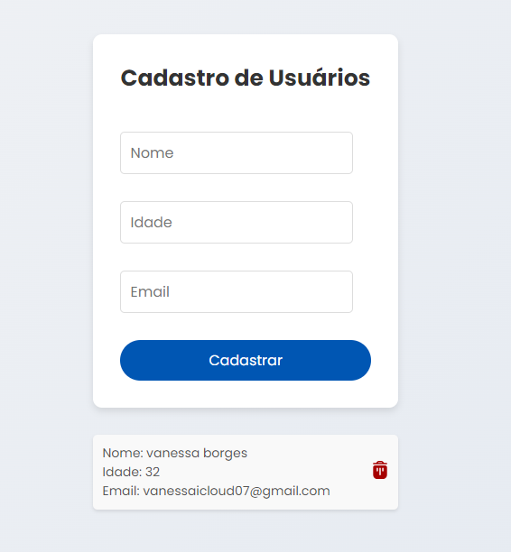

Este projeto é uma aplicação web para cadastro e gerenciamento de usuários, desenvolvida utilizando React no frontend e Prisma com MongoDB no backend.

* Funcionalidades
Cadastro de Usuários: Permite que o usuário insira seu nome, idade e email através de um formulário.
Visualização de Usuários: Lista os usuários cadastrados em cards com suas informações.
Exclusão de Usuários: Permite a remoção de usuários cadastrados.
Pré-requisitos
Antes de começar, certifique-se de ter instalado as seguintes ferramentas:

Node.js (v14.x ou superior)
npm (gerenciador de pacotes do Node.js)
MongoDB (local ou em serviço na nuvem)
Instalação
Siga os passos abaixo para instalar e configurar o projeto localmente:

1. Clonar o repositório
bash
Copiar código
git clone https://github.com/seu-usuario/nome-do-repositorio.git
cd nome-do-repositorio
2. Instalar as dependências
Backend
bash
Copiar código
cd backend
npm install
Frontend
bash
Copiar código
cd frontend
npm install
3. Configurar o banco de dados
Certifique-se de que o MongoDB esteja configurado e acessível. Você pode ajustar as configurações de conexão no arquivo backend/prisma/schema.prisma.

4. Executar o servidor backend
bash
Copiar código
cd backend
npm start
5. Executar o aplicativo frontend
Abra um novo terminal e execute:

bash
Copiar código
cd frontend
npm start
O aplicativo estará disponível em http://localhost:3000.

